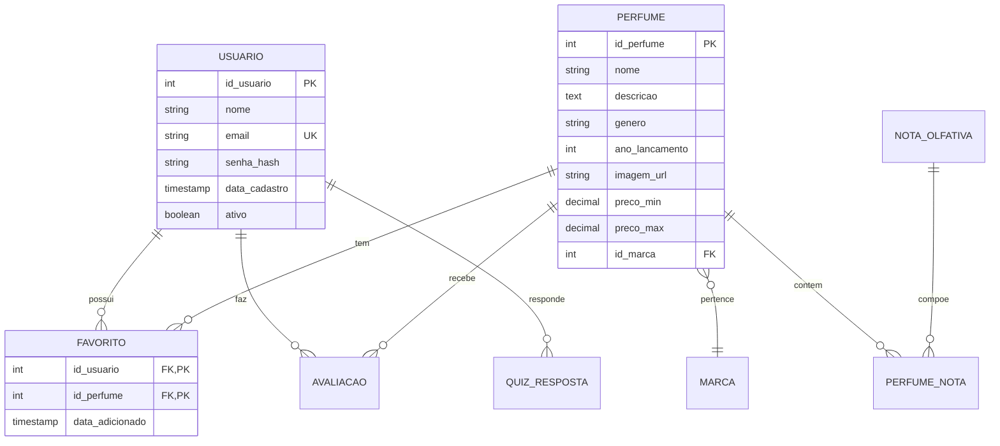

# 🌸 Fragancia - Plataforma de Recomendação de Perfumes

<div align="center">


**Descubra seu aroma perfeito através de um quiz personalizado**

[](https://opensource.org/licenses/MIT)
[](https://nodejs.org/)
[](https://www.postgresql.org/)
[](https://expressjs.com/)

[Demo](#) • [Documentação](#) • [Report Bug](#) • [Request Feature](#)

</div>

---

## 📋 Sobre o Projeto

**Fragancia** é uma plataforma web full-stack que ajuda usuários a descobrirem perfumes ideais através de um sistema de recomendação personalizado. O projeto combina um quiz interativo com um banco de dados completo de fragrâncias, permitindo que os usuários encontrem, avaliem e salvem seus perfumes favoritos.

### ✨ Principais Funcionalidades

- 🎯 **Quiz Personalizado** - Sistema inteligente de perguntas para identificar preferências olfativas
- 👤 **Autenticação Completa** - Registro, login e gerenciamento de perfil com JWT
- 💎 **Catálogo de Perfumes** - Banco de dados com informações detalhadas (notas, longevidade, preços)
- ⭐ **Sistema de Favoritos** - Salve e organize seus perfumes preferidos
- 📊 **Avaliações** - Avalie perfumes e veja reviews de outros usuários
- 📱 **Design Responsivo** - Interface otimizada para desktop, tablet e mobile
- 🔍 **Busca Avançada** - Filtre perfumes por marca, gênero, preço e ocasião
- 📜 **Histórico** - Acompanhe seus quizzes e atividades

---

## 🏗️ Arquitetura do Projeto

```
fragancia/
├── frontend/                 # Interface do usuário
│   ├── index.html
│   ├── css/
│   │   ├── global.css       # Variáveis e estilos globais
│   │   ├── navbar.css       # Navegação
│   │   ├── home.css         # Página inicial
│   │   ├── auth.css         # Login/Cadastro
│   │   ├── quiz.css         # Quiz
│   │   ├── results.css      # Resultados
│   │   ├── perfil.css       # Perfil do usuário
│   │   ├── favoritos.css    # Favoritos
│   │   └── historico.css    # Histórico
│   ├── js/
│   │   ├── api-config.js    # Configuração da API
│   │   ├── auth.js          # Autenticação
│   │   ├── navbar.js        # Navegação
│   │   ├── quiz.js          # Lógica do quiz
│   │   ├── results.js       # Exibição de resultados
│   │   ├── favoritos.js     # Gerenciamento de favoritos
│   │   ├── historico.js     # Histórico de atividades
│   │   └── perfil.js        # Perfil do usuário
│   └── pages/
│       ├── login.html
│       ├── cadastro.html
│       ├── quiz.html
│       ├── resultados.html
│       ├── perfil.html
│       ├── favoritos.html
│       └── historico.html
│
└── backend/                  # API REST
    ├── server.js            # Servidor Express
    ├── config/
    │   └── database.js      # Configuração PostgreSQL
    ├── controllers/         # Lógica de negócio
    │   ├── authController.js
    │   ├── perfumeController.js
    │   ├── favoritoController.js
    │   ├── quizController.js
    │   └── avaliacaoController.js
    ├── routes/              # Rotas da API
    │   ├── auth.js
    │   ├── perfumes.js
    │   ├── favoritos.js
    │   ├── quiz.js
    │   └── avaliacoes.js
    ├── middleware/          # Middlewares
    │   ├── auth.js         # Autenticação JWT
    │   └── validation.js   # Validação de dados
    ├── utils/              # Utilitários
    │   ├── hashPassword.js
    │   └── generateToken.js
    └── database/           # Scripts SQL
        ├── schema.sql      # Estrutura do banco
        └── seed.sql        # Dados iniciais
```

---

## 🚀 Tecnologias Utilizadas

### Frontend
- **HTML5** - Estrutura semântica
- **CSS3** - Estilos modernos com Flexbox/Grid
- **JavaScript (Vanilla)** - Lógica e interatividade
- **Font Awesome** - Ícones
- **Google Fonts** - Tipografia (Montserrat)

### Backend
- **Node.js** - Runtime JavaScript
- **Express.js** - Framework web
- **PostgreSQL** - Banco de dados relacional
- **bcryptjs** - Hash de senhas
- **jsonwebtoken** - Autenticação JWT
- **express-validator** - Validação de dados
- **dotenv** - Variáveis de ambiente
- **CORS** - Segurança cross-origin

---

## 📊 Modelo de Dados



---

## ⚙️ Instalação e Configuração

### Pré-requisitos

- **Node.js** >= 18.x
- **PostgreSQL** >= 14.x
- **npm** >= 10.x

### 1️⃣ Clone o Repositório

```bash
git clone https://github.com/seu-usuario/fragancia.git
cd fragancia
```

### 2️⃣ Configurar Backend

```bash
cd backend
npm install
```

### 3️⃣ Configurar Banco de Dados

```bash
# Iniciar PostgreSQL
sudo service postgresql start

# Criar banco de dados
sudo -u postgres psql
CREATE DATABASE fragancia;
\q

# Executar schema
sudo -u postgres psql -d fragancia -f database/schema.sql

# Inserir dados iniciais
sudo -u postgres psql -d fragancia -f database/seed.sql
```

### 4️⃣ Configurar Variáveis de Ambiente

Crie um arquivo `.env` na pasta `backend/`:

```env
PORT=3000
NODE_ENV=development

DB_HOST=localhost
DB_PORT=5432
DB_NAME=fragancia
DB_USER=postgres
DB_PASSWORD=sua_senha_aqui

JWT_SECRET=seu_secret_super_seguro_aqui
JWT_EXPIRE=7d

FRONTEND_URL=http://127.0.0.1:5500
```

### 5️⃣ Iniciar o Servidor

```bash
# Modo desenvolvimento
npm run dev

# Modo produção
npm start
```

### 6️⃣ Abrir Frontend

Abra o arquivo `frontend/index.html` com Live Server ou acesse diretamente:
```
http://127.0.0.1:5500/index.html
```

---

## 🔌 Endpoints da API

### Autenticação
```http
POST   /api/auth/register     # Criar conta
POST   /api/auth/login        # Login
GET    /api/auth/me           # Dados do usuário (requer token)
```

### Perfumes
```http
GET    /api/perfumes          # Listar todos
GET    /api/perfumes/:id      # Buscar por ID
GET    /api/perfumes/search   # Buscar com filtros
```

### Favoritos
```http
GET    /api/favoritos         # Listar favoritos (requer token)
POST   /api/favoritos/:id     # Adicionar favorito (requer token)
DELETE /api/favoritos/:id     # Remover favorito (requer token)
```

### Quiz
```http
POST   /api/quiz              # Salvar quiz (requer token)
GET    /api/quiz/historico    # Histórico (requer token)
GET    /api/quiz/ultimo       # Último quiz (requer token)
```

### Avaliações
```http
GET    /api/avaliacoes/perfume/:id  # Listar avaliações
POST   /api/avaliacoes/:id          # Criar avaliação (requer token)
DELETE /api/avaliacoes/:id          # Deletar avaliação (requer token)
```

---

## 🧪 Testando a API

### Com cURL:

```bash
# Health Check
curl http://localhost:3000/api/health

# Registrar usuário
curl -X POST http://localhost:3000/api/auth/register \
  -H "Content-Type: application/json" \
  -d '{"nome": "João", "email": "joao@test.com", "senha": "123456"}'

# Login
curl -X POST http://localhost:3000/api/auth/login \
  -H "Content-Type: application/json" \
  -d '{"email": "joao@test.com", "senha": "123456"}'

# Listar perfumes
curl http://localhost:3000/api/perfumes
```

---

## 🎨 Personalização

### Cores e Tema

Todas as cores estão centralizadas em `css/global.css`:

```css
:root {
    --color-primary: #d4af37;      /* Dourado */
    --color-secondary: #f0f0f0;     /* Cinza claro */
    --bg-dark: #222;                /* Fundo escuro */
    --text-primary: #f4f4f4;        /* Texto principal */
}
```

### Adicionar Novos Perfumes

Edite o arquivo `database/seed.sql` e execute:

```bash
sudo -u postgres psql -d fragancia -f database/seed.sql
```

---

## 📱 Screenshots

<div align="center">

### Página Inicial


### Quiz Interativo


### Resultados


</div>

---

## 🤝 Contribuindo

Contribuições são sempre bem-vindas! Siga os passos:

1. Fork o projeto
2. Crie uma branch para sua feature (`git checkout -b feature/NovaFeature`)
3. Commit suas mudanças (`git commit -m 'Adiciona nova feature'`)
4. Push para a branch (`git push origin feature/NovaFeature`)
5. Abra um Pull Request

---

## 📝 Licença

Este projeto está sob a licença MIT. Veja o arquivo [LICENSE](LICENSE) para mais detalhes.

---

## 👨‍💻 Autor

**Luis Carvalho**

- GitHub: [@luiscarvalho](https://github.com/luiscarvalho)
- LinkedIn: [Luis Carvalho](https://linkedin.com/in/luiscarvalho)
- Email: luis@fragancia.com

---

## 🙏 Agradecimentos

- [Tom Ford](https://www.tomford.com/) - Inspiração de perfumes
- [Maison Francis Kurkdjian](https://www.franciskurkdjian.com/) - Catálogo de fragrâncias
- [Nishane](https://nishaneperfume.com/) - Perfumes de nicho
- Comunidade de desenvolvedores open-source

---

## 📚 Roadmap

- [ ] Sistema de recomendação com Machine Learning
- [ ] Integração com APIs de e-commerce
- [ ] App mobile (React Native)
- [ ] Sistema de notificações push
- [ ] Comparação de preços em tempo real
- [ ] Chat entre usuários
- [ ] Blog sobre perfumaria
- [ ] Gamificação (badges, níveis)

---

<div align="center">

**Feito com ❤️ e ☕ por Luis Carvalho**

⭐ Se este projeto te ajudou, considere dar uma estrela!

</div>
